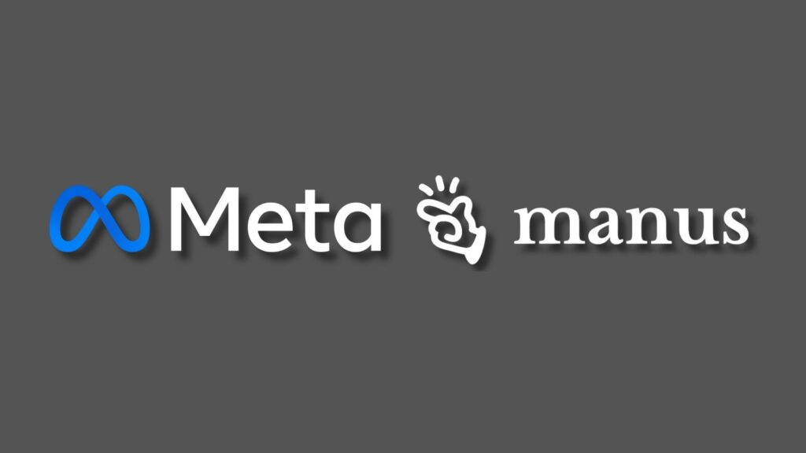
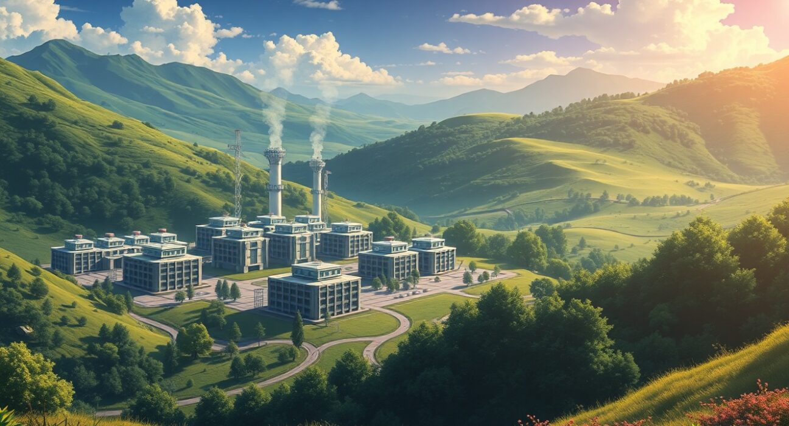
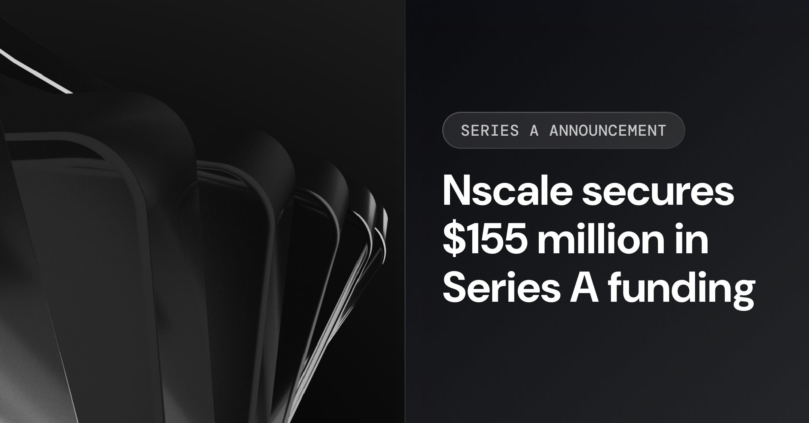

# 2026年1月9日の主要AIニュース

昨日の海外AI業界における最もインパクトのあるニュースを5つ厳選してご紹介します。これらのニュースは、AI技術の進化、大手企業の戦略、そして今後の市場動向を理解する上で重要な示唆を与えます。

## 1. MetaによるManus AIの買収と統合

Metaは、シンガポールを拠点とするAIスタートアップ「Manus AI」を20億ドル以上で買収しました [1] [2]。Manus AIは自律型AIエージェントの開発で知られ、わずか8ヶ月で1億ドルの年間経常収益（ARR）を達成したと報じられています。マーク・ザッカーバーグCEOは、Manusの技術をMetaの消費者向けおよびビジネス向け製品に統合し、「エージェント型パーソナルAI」のビジョンを加速させる意向を示しています [1]。しかし、この買収は中国当局によって技術移転法違反の疑いで調査されており、今後の動向が注目されます [2]。

## 2. MetaがAIデータセンター向けに大規模な原子力契約を締結

Metaは、AIデータセンターへの電力供給を確保するため、Vistra、TerraPower、Okloの3社と合計6.6ギガワットに及ぶ大規模な原子力契約を締結しました [3]。これは、オハイオ州に建設中の1ギガワット級データセンター「Prometheusスーパークラスター」を含む、同社のAIインフラに電力を供給することを目的としています。特に、TerraPowerの「Natrium」次世代原子炉や、OpenAIのサム・アルトマン氏が支援するOkloの原子炉を活用する計画で、2035年までの稼働を目指しています [3]。

## 3. AIインフラ企業Nscaleが20億ドルの資金調達を計画

NVIDIAが支援するAIクラウドプロバイダーのNscaleは、約20億ドルの新たな資金調達ラウンドに向けて、ゴールドマン・サックスやJPモルガン・チェースと協議を進めていると報じられています [4]。Nscaleは、MicrosoftやOpenAIといった大手企業とも大規模な契約を結んでおり、欧州や米国でのAIインフラ構築を加速させています。同社は2025年9月にも11億ドルを調達したばかりであり、AIインフラ市場への投資が活発化していることを示しています [4]。

## 4. IntelがCES 2026で「Core Ultra Series 3 (Panther Lake)」を発表

Intelは、CES 2026において次世代モバイルプロセッサ「Core Ultra Series 3」（開発コード名：Panther Lake）を正式に発表しました [5] [6]。この新しいプロセッサは、Intel 18Aプロセス技術を採用し、AI処理能力（NPU/GPU TOPS）が大幅に向上しています。また、新しいArc B390統合GPUを搭載し、グラフィックス性能も50%向上しており、AI PC市場におけるIntelのリーダーシップを強化する狙いがあります [5]。

## 5. AMDがCES 2026で「Ryzen AI 400」と「MI440X GPU」を発表

AMDのリサ・スーCEOは、CES 2026の基調講演で、次世代AI PC向けの「Ryzen AI 400シリーズ」とエンタープライズ向け「MI440X GPU」を発表しました [7] [8]。Ryzen AI 400シリーズは、Copilot+ PCの要件を大幅に上回るAI性能を提供し、MI440Xはオンプレミスのエンタープライズ展開向けに最適化されています。さらに、開発者向けの「Ryzen AI Halo」プラットフォームも公開され、AIエコシステムの拡大に貢献すると期待されています [7]。

## 参考文献

[1] Meta to buy Singapore-based AI startup Manus for at least $2b - SE Asia. (2026, January 9). Retrieved from [https://seasia.co/short/meta-to-buy-singapore-based-ai-startup-manus-for-at-least-2b](https://seasia.co/short/meta-to-buy-singapore-based-ai-startup-manus-for-at-least-2b)
[2] China Is Now Investigating Meta's Acquisition Of Manus. (2026, January 9). Retrieved from [https://techround.co.uk/news/china-investigating-metas-acquisition-manus/](https://techround.co.uk/news/china-investigating-metas-acquisition-manus/)
[3] Meta announces a slew of nuclear energy agreements. (2026, January 9). Engadget. Retrieved from [https://www.engadget.com/ai/meta-announces-a-slew-of-nuclear-energy-agreements-165337159.html](https://www.engadget.com/ai/meta-announces-a-slew-of-nuclear-energy-agreements-165337159.html)
[4] Nscale looks to raise $2bn in funding round - report - DCD. (2026, January 9). Retrieved from [https://www.datacenterdynamics.com/en/news/nscale-looks-to-raise-2bn-in-funding-round-report/](https://www.datacenterdynamics.com/en/news/nscale-looks-to-raise-2bn-in-funding-round-report/)
[5] Intel launches Core Ultra Series 3 Panther Lake on Intel 18A at CES 2026. (2026, January 9). Fudzilla. Retrieved from [https://fudzilla.com/intel-launches-core-ultra-series-3-panther-lake-on-intel-18a-at-ces-2026/](https://fudzilla.com/intel-launches-core-ultra-series-3-panther-lake-on-intel-18a-at-ces-2026/)
[6] All the tech and gadgets announced at CES 2026. (2026, January 9). Engadget. Retrieved from [https://www.engadget.com/general/all-the-tech-and-gadgets-announced-at-ces-2026-130124023.html](https://www.engadget.com/general/all-the-tech-and-gadgets-announced-at-ces-2026-130124023.html)
[7] CES 2026: The Future is Here. (2026, January 9). PR Newswire. Retrieved from [https://www.prnewswire.com/news-releases/ces-2026-the-future-is-here-302657737.html](https://www.prnewswire.com/news-releases/ces-2026-the-future-is-here-302657737.html)
[8] CES 2026: The Future is Here. (2026, January 9). CES.tech. Retrieved from [https://www.ces.tech/press-releases/ces-2026-the-future-is-here](https://www.ces.tech/press-releases/ces-2026-the-future-is-here)
