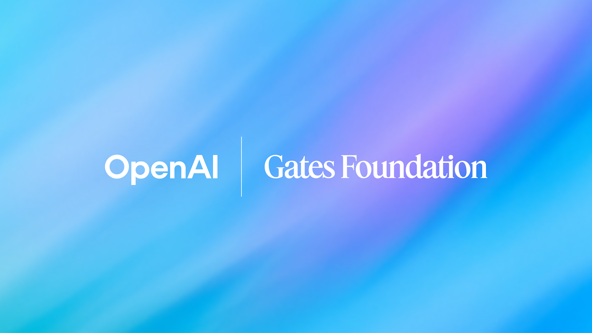
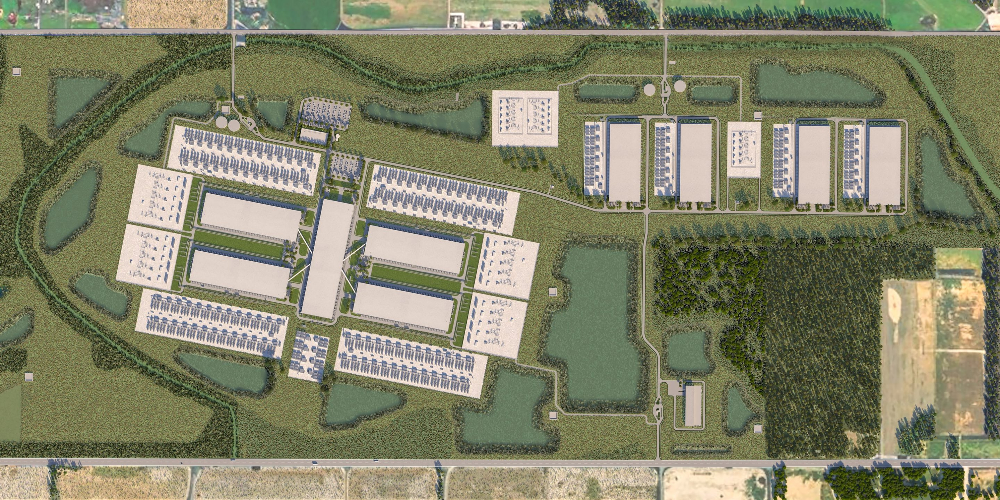

# 海外AIニュース・ハイライト（2026年1月22日）

昨日のAI業界における最もインパクトのあるニュース上位5件をまとめました。グローバルな医療支援、巨大インフラ投資、そして主要な人材獲得など、業界の勢力図を塗り替える重要な進展が見られました。

---

## 1. OpenAIとビル・ゲイツ財団、アフリカの医療支援に5,000万ドルを投じる「Horizon 1000」を発表
OpenAIとビル&メリンダ・ゲイツ財団は、アフリカの1,000の主要な医療クリニックにAIを導入するための新イニシアチブ**「Horizon 1000」**を立ち上げました。この5,000万ドルの共同出資により、資金、技術、および技術サポートが提供されます。

> **重要性:** この提携は、AIを単なる商用ツールではなく、世界の公衆衛生上の課題を解決するための強力な武器として位置づけるものです。特に医療従事者不足に悩む地域での診断支援やワークフローの改善が期待されています。

*   **リンク:** [Gates Foundation, OpenAI launch $50M AI health initiative](https://www.geekwire.com/2026/gates-foundation-openai-launch-50m-ai-health-initiative-targeting-1000-clinics-in-africa/)
*   **画像:** 

---

## 2. Google、感情理解AIのスタートアップ「Hume AI」の主要チームを買収
Googleは、音声AIスタートアップ「Hume AI」のCEOアラン・コーエン氏を含む主要エンジニアチームを事実上買収（人材獲得）しました。これは、Geminiの音声機能と言語モデルの感情理解能力を大幅に強化するためのライセンス契約の一部です。

| 項目 | 詳細 |
| :--- | :--- |
| **買収対象** | Hume AI 主要チーム（CEOアラン・コーエン氏含む） |
| **目的** | Geminiの音声インターフェースと感情理解の強化 |
| **背景** | 音声がAIとの主要なインターフェースになりつつある市場動向 |

*   **リンク:** [Google snags team behind AI voice startup Hume AI](https://techcrunch.com/2026/01/22/google-reportedly-snags-up-team-behind-ai-voice-startup-hume-ai/)
*   **画像:** 

---

## 3. Meta、ルイジアナ州に「マンハッタン級」の巨大データセンター「Hyperion」を建設
Meta（旧Facebook）は、ルイジアナ州リッチランド郡に、将来のフロンティア級AIモデルのトレーニングを支えるための巨大データセンター**「Hyperion」**を建設中であることを明らかにしました。ドナルド・トランプ大統領もダボス会議で、マーク・ザッカーバーグ氏から「マンハッタン並みの規模」の施設を見せられたと言及しています。

*   **戦略:** 100億ドル規模の投資とされ、自社で電力を生成・確保するインフラ競争において、Metaが圧倒的な優位性を狙っていることを示しています。
*   **リンク:** [Meta is sinking $10 billion into Louisiana to build its massive Hyperion data center](https://fortune.com/2026/01/21/trump-says-mark-zuckerberg-showed-him-a-manhattan-sized-ai-data-center/)
*   **画像:** 

---

## 4. Nvidia CEO ジェンスン・ファン氏、ダボスでAIの成長と電力制約の関係を警告
Nvidiaのジェンスン・ファンCEOは、ダボス会議（世界経済フォーラム）において、AIの爆発的な成長が**電力インフラの制約**に直面していると警鐘を鳴らしました。AIのリーダーシップは、もはやアルゴリズムだけでなく、電力供給とデータセンターの構築能力に依存するようになっています。

*   **ポイント:** AIの計算能力に対する需要は供給を上回り続けており、国家レベルでのエネルギー政策がAI競争の勝敗を分ける鍵になると強調しました。
*   **リンク:** [Nvidia CEO Jensen Huang’s Davos message](https://techstartups.com/2026/01/22/top-tech-news-today-january-22-2026/)

---

## 5. 米下院、AIチップの輸出規制を強化する新法案を可決
米下院は、高度なAIチップの輸出管理をより厳格化し、執行力を高めるための新法案を可決しました。これは、国家安全保障上の懸念から、最先端の半導体技術が競合他国に流出するのを防ぐことを目的としています。

*   **影響:** NvidiaやAMDなどのチップメーカーにとっては、輸出プロセスがさらに複雑化する可能性があり、グローバルなサプライチェーンとAI開発の地政学的な分断が進むことが懸念されています。
*   **リンク:** [House passes bill aimed at tightening AI chip export control enforcement](https://techstartups.com/2026/01/22/top-tech-news-today-january-22-2026/)

---

### その他の注目トピック
*   **Appleの戦略転換:** 次世代Siri（LLM Siri）のトレーニングに、自社製チップではなくGoogleのTPUを使用しているとの報道。
*   **教育現場のセキュリティ:** Google Workspace for EducationにAIを活用したランサムウェア検出機能が追加。
