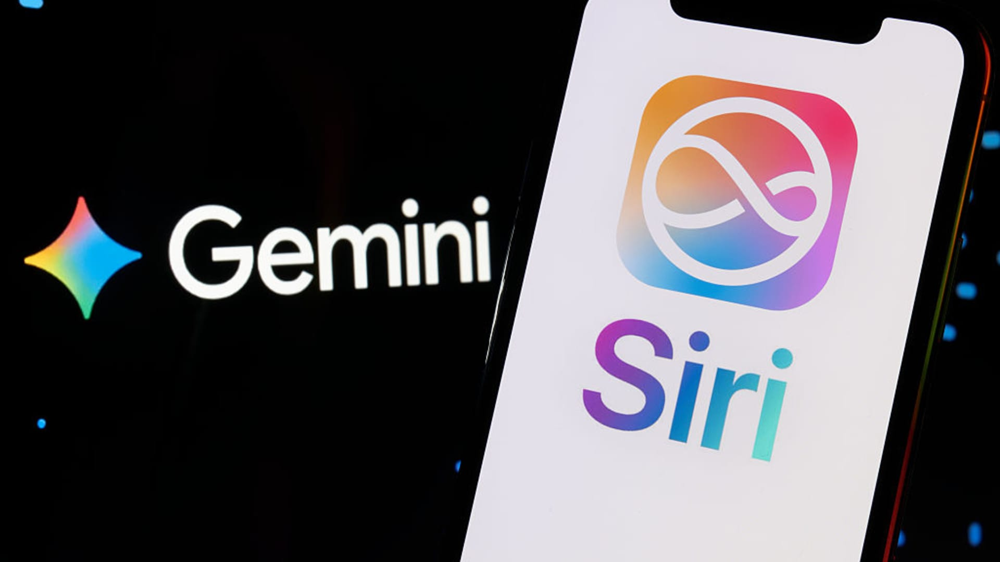
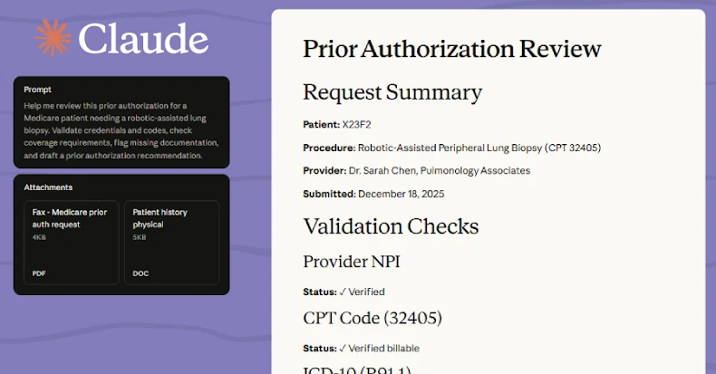
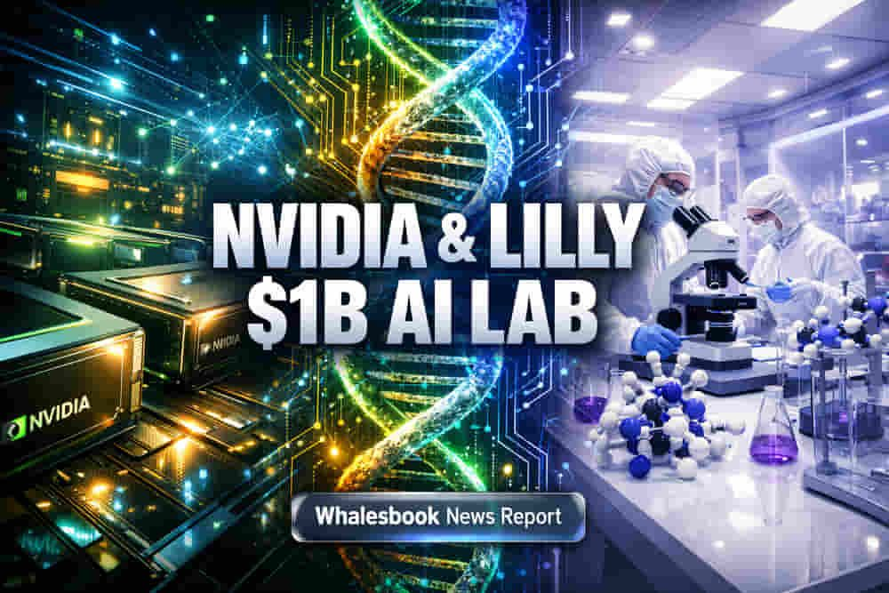
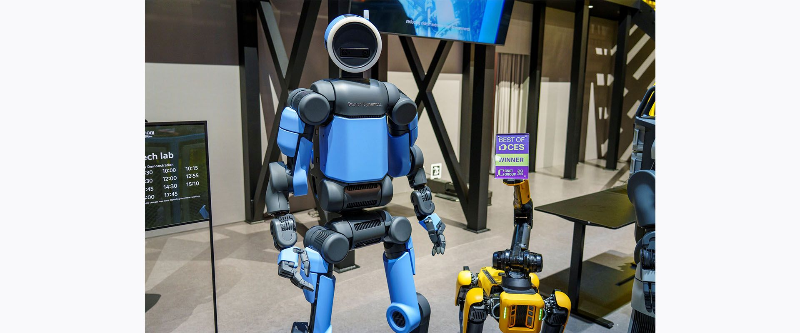

# 海外AIニュース・ハイライト（2026年1月12日）

昨日のAI業界における最もインパクトのあるニュース上位5つをまとめました。

---

## 1. AppleとGoogleが提携：次世代SiriにGeminiを搭載
AppleとGoogleは、AppleのAI機能（Apple Intelligence）を強化するための複数年にわたる戦略的提携を発表しました。これにより、次世代のSiriはGoogleのGeminiモデルをベースに構築され、より高度なパーソナライゼーションと推論能力を備えることになります。

- **主な内容**: Appleの基盤モデルにGeminiを採用。Siriの劇的な進化。
- **リンク**: [CNBCの記事](https://www.cnbc.com/2026/01/12/apple-google-ai-siri-gemini.html)
- **画像**: 

---

## 2. Anthropicが「Claude for Healthcare」を発表
Anthropicは、医療従事者や患者を支援するための専用AIツールスイート「Claude for Healthcare」をリリースしました。これはOpenAIの「ChatGPT Health」に対抗するもので、医療データの安全な処理と臨床レポートの自動生成に特化しています。

- **主な内容**: 医療業界向けにカスタマイズされたClaude。HIPAA準拠のデータ処理。
- **リンク**: [TechCrunchの記事](https://techcrunch.com/2026/01/12/anthropic-announces-claude-for-healthcare-following-openais-chatgpt-health-reveal/)
- **画像**: 

---

## 3. NVIDIAとEli Lillyが10億ドル規模のAI創薬ラボを設立
NVIDIAと製薬大手のEli Lillyは、AIを活用した創薬を加速させるための共同イノベーションラボの設立を発表しました。5年間で10億ドル以上を投資し、物理AIとロボティクスを組み合わせて新薬の開発・生産プロセスを再構築します。

- **主な内容**: AIによる創薬の自動化。10億ドルの巨額投資。
- **リンク**: [NVIDIA公式発表](http://nvidianews.nvidia.com/news/nvidia-and-lilly-announce-co-innovation-lab-to-reinvent-drug-discovery-in-age-of-ai)
- **画像**: 

---

## 4. HyundaiとBoston Dynamicsが新型AtlasをCES 2026で披露
CES 2026にて、Hyundai傘下のBoston Dynamicsが、生産準備が整った新型人型ロボット「Atlas」を公開しました。K-popに合わせてダンスを披露するなどのデモンストレーションを行い、CNETの「Best Robot」賞を受賞しました。

- **主な内容**: 実用化フェーズに入ったAtlas。製造現場への導入計画。
- **リンク**: [Reutersの記事](https://www.reuters.com/business/autos-transportation/hyundai-boston-dynamics-unveil-humanoid-robot-atlas-ces-2026-01-12/)
- **画像**: 

---

## 5. Googleが「Universal Commerce Protocol (UCP)」を発表
Googleは、AIエージェントがオンラインで商品の注文や支払いを行うためのオープン標準プロトコル「Universal Commerce Protocol (UCP)」のドラフトを公開しました。これにより、AIが自律的にショッピングを行う「エージェント・コマース」の普及が期待されます。

- **主な内容**: AIエージェント間の商取引を標準化。ショッピングの自動化。
- **リンク**: [CIOの記事](https://www.cio.com/article/4116077/googles-universal-commerce-protocol-aims-to-simplify-life-for-shopping-bots-and-cios.html)

---
*作成日: 2026年1月13日*
